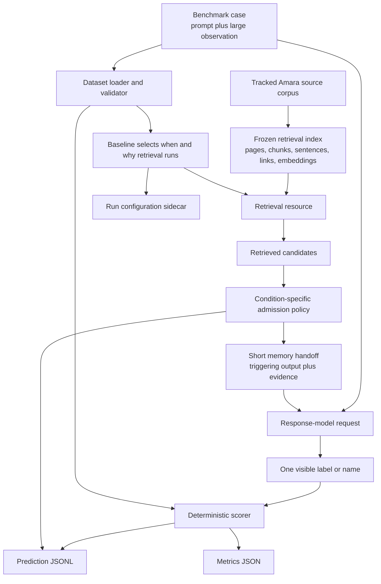
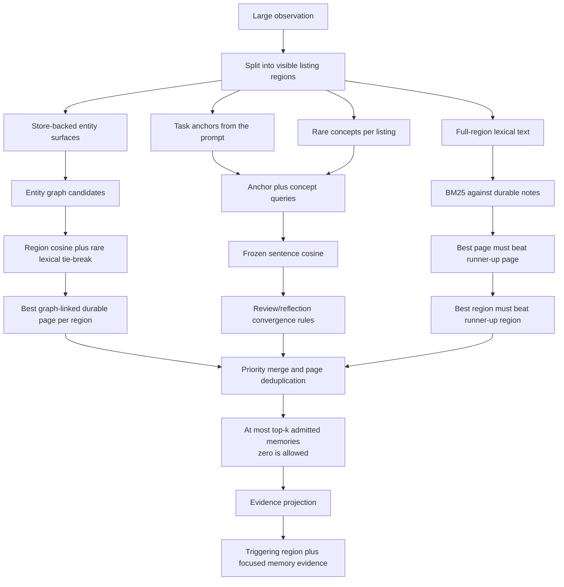

# PARM Architecture

PARM tests a specific failure mode in personal-memory systems: a prompt does
not contain enough information to retrieve the right memory, but a later tool
result or agent output does. The system must notice the new cue, retrieve only
the memory that now matters, and use it to make a better decision.

## One case in plain language

1. The user asks for one conference session.
2. A 9,000-token agenda arrives. One row mentions NovaMind's Texas grid pilot.
3. A durable note says Amara needs that pilot evidence before recommending an
   investment.
4. PARM links the agenda row to the note and hands both to the response model.
5. The model selects the NovaMind session.
6. In the cue-ablated twin, the row names an unrelated company. PARM should
   admit nothing and preserve the agenda's ordinary best choice.

The positive and control together test both halves of the claim. Retrieval
must help when the cue exists and stay quiet when it does not.

## End-to-end waterfall

The frozen index is neutral. It does not decide when retrieval should run or
which pages should reach the response model. Each baseline supplies that
policy so the benchmark can compare mechanisms over the same memory substrate.

## The benchmark layer

`data/benchmark_v1/cases.jsonl` contains 54 cases: 18 scenarios, each with
three variants.

| Variant | Observation | Expected behavior |
| --- | --- | --- |
| Positive | Contains the decisive incidental cue | Retrieve and select the memory-conditioned choice |
| Cue-ablated | Replaces only the decisive cue | Preserve the output-only choice |
| Memory-included | Reuses the positive observation and puts the memory in the prompt | Select the memory-conditioned choice without depending on retrieval |

`src/parm_bench/dataset.py` resolves context files and replacements, validates
the schema, checks source hashes, and rejects unsafe gold-source definitions.
`src/parm_bench/scoring.py` then scores the visible final choice and the
retrieval trace independently.

The three variants separate different failures:

- Positive failure can mean retrieval missed, judgment failed, or the fixture
  lacks enough separation.
- Control failure means memory changed a decision without the intended cue.
- Ceiling failure means the response model or fixture cannot use explicit
  memory reliably, so retrieval should not receive all the blame.

## Retrieval conditions and modes

The baseline is the retrieval condition. It controls when retrieval happens
and what text becomes the query.

| Condition | Retrieval trigger | Admission behavior |
| --- | --- | --- |
| `no_memory` | Never | No memory |
| `input_rag` | Original prompt only | Admit fixed top-k |
| `prompted_memory_tool` | Model elects to call a tool after seeing the observation | Admit fixed top-k when called |
| `naive_output_rag` | Whole tool output, model output, or both | Admit fixed top-k |
| `all_entity_output_rag` | Every exact entity found in the observation | Admit the deduplicated union |
| `parm` | Cue regions inside the observation | Admit only candidates that clear a PARM channel |

`input_rag`, `prompted_memory_tool`, and `naive_output_rag` use
`IndexRetriever`. Their independent retrieval-mode axis controls how one query
is ranked:

- `dense`: OpenAI embedding cosine over frozen chunks.
- `hybrid`: body BM25 and dense rankings fused with reciprocal rank fusion.
- `enhanced`: hybrid ranking plus three frozen query expansions, title BM25,
  and a small graph rerank.

`all_entity_output_rag` uses `EntityExactRetriever`. `parm` uses
`PARMConvergenceRetriever`. These are fixed retrieval mechanisms, so the CLI
rejects `--retrieval-mode` for them.

## PARM retrieval waterfall

PARM treats the large observation as a set of listing regions. It creates
several cheap views of those regions, then admits only durable pages supported
by a channel-specific rule.

### Entity graph channel

The entity extractor uses an Aho-Corasick gazetteer built from the frozen
store. If a listing contains known entities, PARM follows inbound links to
durable pages. Candidates must clear a region cosine floor. When several pages
share the same entities, rare exact terms in the listing provide a lexical
tie-break before cosine.

This channel handles relations such as a named founder, company, or
counterparty connected to an existing meeting or email.

### Task-conditioned semantic channel

spaCy supplies task anchors and rare noun concepts without an LLM in the
retrieval loop. Short anchor-concept queries are embedded and compared with the
frozen sentence matrix. The selector currently restricts this path to
review/reflection pages and accepts multi-concept convergence or a high
anchored singleton.

This channel handles patterns such as burnout, recovery, and recurring
behavior when no entity link is sufficient.

### Contrastive durable-note channel

Each listing region is scored with BM25 against unperturbed durable notes. A
note is admitted only when two contrasts agree:

1. the best note for that region beats the second-best note; and
2. that region's winning score beats the best score from every other region.

Both ratios default to `1.25`. This opens coverage to notes whose filenames are
not reviews while still requiring the observation to contain one unusually
specific memory-shaped region.

### Merge and evidence handoff

Admissions are deduplicated by page. Channel priority is:

1. direct-note contrast;
2. entity graph;
3. semantic multi-concept;
4. semantic anchored singleton.

The response model receives the exact triggering listing beside a focused
memory excerpt. It never receives benchmark gold IDs, perturbation labels, or
the retrieval scores.

## Frozen artifacts and replay

Canonical runs depend on tracked, hashed artifacts:

| Artifact | Purpose |
| --- | --- |
| `data/retrieval-indexes/amara-life-v1` | Neutral pages, chunks, sentences, links, and embeddings |
| `data/expansion-caches/...` | Frozen enhanced-mode query alternatives |
| `data/response-caches/...` | Reusable response-model calls keyed by the full request |
| `data/benchmark-results/*.jsonl` | One prediction and trace per case |
| `data/benchmark-results/*.config.json` | Exact condition, model, constants, and artifact hashes |
| `data/benchmark-results/*.metrics.json` | Deterministic aggregate, split, and per-case scores |

The CLI loads GBrain only while intentionally rebuilding the index. A canonical
benchmark run reads the frozen artifact directly.

## Module map

| Module | Responsibility |
| --- | --- |
| `dataset.py` | Load, resolve, and validate benchmark cases |
| `baselines.py` | Define retrieval timing, query source, admission handoff, and baseline registry |
| `retrieval.py` | Load the frozen index and implement all ranking/retrieval mechanisms |
| `models.py` | OpenAI response calls, memory-tool decisions, and response caching |
| `scoring.py` | Deterministic choice, admission, poison, privacy, and split metrics |
| `cli.py` | Validate experiment axes, run cases, write config sidecars, and score results |
| `workbench.py` and `web/` | Local browser inspection of cases, traces, and responses |
| `retrieval_export.py` | Freeze neutral GBrain data into the validated index format |

## Design trade-offs

PARM optimizes precision under noise, so it accepts lower coverage rather than
injecting many weak memories. This is why zero admission is a valid result.
The baseline matrix measures the cost of the opposite choice: broad input or
output RAG can retrieve more gold sources while also admitting hundreds of
spurious pages and changing controls.

The current ranker is deliberately inspectable. BM25, cosine, graph links,
fixed thresholds, and exact traces make a failure attributable. A learned
ranker could cover more cue shapes, but it would require a larger train and
held-out evaluation split to avoid turning the benchmark into its training
set.

The deterministic final-choice scorer is narrow by design. It gives exact,
repeatable primary metrics, but it does not measure whether a long natural
response was helpful, calibrated, or appropriately private. Those broader
questions belong in an additional realistic end-to-end evaluation layer, not
in an unversioned replacement for the core triplets.

## Related documents

- [Research claim and scope](research-scope.md)
- [Run PARMBench](running-parmbench.md)
- [Construct benchmark cases](benchmark-construction.md)
- [Evaluation contract](benchmark-evaluation.md)
- [Rebuild the memory index](rebuilding-memory-index.md)
- [Larger dataset candidates](dataset-candidates.md)
- [Expanded benchmark first pass](results/benchmark-expansion-first-pass.md)
