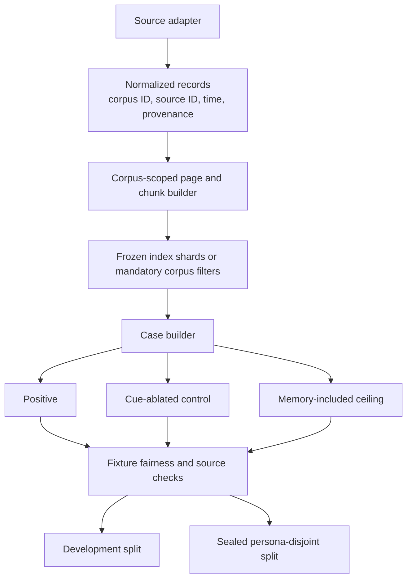

# Larger Dataset Candidates

This survey asks which public datasets can expand PARMBench without changing
the research question. A useful source must support more than long-context
recall. It needs a longitudinal memory corpus, a later observation that can
introduce a new cue, and a counterfactual where removing that cue should prevent
memory from changing the answer.

The survey was checked against Hugging Face dataset cards and schemas on
2026-07-27. It covered long-term memory, personalization, multi-session
dialogue, agent trajectories, tool use, task-oriented dialogue, recommendation,
email, and calendar-like data.

> **Status, 2026-08-03.** PersonaMem-v2 was built out and then dropped. The
> converted benchmarks, indexes, caches, and results have been removed from the
> repository, and the project is not returning to it. The evaluation it was
> meant to carry now runs on PARMBench Workflows over a hand-authored corpus.
> The assessment below is kept as the survey it was: it records why the source
> looked right, which is worth having if the question is ever reopened. Read
> the recommendation as historical.

## Recommendation

Use two sources for different parts of the next evaluation:

1. Build the larger controlled benchmark from
   [PersonaMem-v2](https://huggingface.co/datasets/bowen-upenn/PersonaMem-v2).
   It has the best raw material for generating PARMBench triplets at scale:
   isolated personas, long histories, implicit preferences, gold related
   snippets, correct and incorrect answers, preference updates, and
   persona-disjoint splits.
2. Build the realistic end-to-end suite from
   [LongMemEval-V2](https://huggingface.co/datasets/xiaowu0162/longmemeval-v2).
   Its web and enterprise trajectories supply natural agent observations and
   recurring task state. These cases require human review but make a stronger
   real-world claim than generated catalogs.

These sources are complementary. PersonaMem-v2 provides enough structured data
to compare retrieval mechanisms and tune on separate users. LongMemEval-V2
provides the realistic traces needed to test whether the mechanism helps an
agent doing ordinary work.

## Candidate comparison

| Dataset | Verified scale | What it contributes | Required reconstruction | Reuse status |
| --- | ---: | --- | --- | --- |
| [PersonaMem-v2](https://huggingface.co/datasets/bowen-upenn/PersonaMem-v2) | 1,000 personas and 26,100 unique preference, snippet, and Q&A records; 32K and 128K histories | Implicit personal facts, source snippets, answer counterfactuals, updates, sensitive-data flags, persona-disjoint train/validation/benchmark splits | Turn each direct personalization query into an ordinary task plus a later tool result that reveals the cue; build one memory corpus per persona | CC BY 4.0; synthetic data with documented safety filtering |
| [LongMemEval-V2](https://huggingface.co/datasets/xiaowu0162/longmemeval-v2) | 451 human-curated questions and 1,870 web or enterprise task trajectories | Natural late observations, screenshots, changing task state, workflows, and environment-specific knowledge | Map earlier trajectory facts into memory records; pair later observations with cue-ablated twins; review each case by hand | Apache 2.0 |
| [Amazon Reviews 2023](https://huggingface.co/datasets/McAuley-Lab/Amazon-Reviews-2023) | 571.54 million reviews, 54.51 million users, and 48.19 million items | Real longitudinal preferences, timestamps, product text, metadata, and exact held-out interactions | Use a bounded category and k-core subset; turn candidate products into a later search result; prevent future-review leakage | No license is stated on the Hugging Face card; source terms and privacy review are required |
| [LongMemEval cleaned](https://huggingface.co/datasets/xiaowu0162/longmemeval-cleaned) | 500-question LongMemEval-S lineage with roughly 100K-token histories | Large-context retrieval stress, exact answers, temporal and multi-session memory | Move the decisive query fact into a later observation and preserve the original answer; construction is less natural than PersonaMem-v2 | MIT |
| [LongLaMP](https://huggingface.co/datasets/LongLaMP/LongLaMP) | 130,569 examples across abstract, product-review, and topic-writing configurations | Long user profiles and natural long-form outputs at useful scale | Synthesize later observations; add paired controls; use human or calibrated-judge scoring for open-ended output | No license is stated on the Hugging Face card |
| [Multi-Session Chat](https://huggingface.co/datasets/nayohan/multi_session_chat) | 23,445 session rows in the inspected mirror | Multi-session personal facts and dialogue-level corpus boundaries | Generate task, tool result, gold decision, and counterfactual; audit conversational quality | Mirror card has no license; another cleaned mirror states GPL 3.0 |
| [LoCoMo](https://huggingface.co/datasets/adymaharana/locomo) | 35 long conversations | Dense longitudinal episodes and personal relationships | Construct and review all output-cued tasks; too few profiles for the main scale benchmark | CC BY-NC 4.0 |
| [Enron email](https://huggingface.co/datasets/corbt/enron-emails) | 517,401 messages | Real enterprise history, commitments, relationships, and timestamps | Isolate mailboxes, redact personal data, annotate late cues and gold actions, and construct controls | No license is stated on the inspected card; high privacy and redistribution risk |
| [CoMEM agent trajectories](https://huggingface.co/datasets/WenyiWU0111/CoMEM-agent-memory-trajectories) | 222,235 generated tasks and 188,451 GUI trajectories | Large GUI task and observation source with success and failure traces | Determine whether earlier traces contain reusable memory; add user-specific facts and causal controls | Apache 2.0 |
| [Taskmaster-2](https://huggingface.co/datasets/google-research-datasets/taskmaster2) | About 17,300 spoken task-oriented dialogues in seven domains | Natural search and recommendation language plus annotated slots | No persistent user histories; would need a separate memory source and synthetic cross-session identity | CC BY 4.0 |
| [ToolBench mirror](https://huggingface.co/datasets/Maurus/ToolBench) | 88,895 API-query rows | Tool schemas and query domains | No longitudinal user memory or full observation traces in this mirror; useful only as an output scaffold | No license is stated on the inspected mirror card |

Small long-memory instruction sets, generic QA corpora, and software-agent
trajectories were excluded from the shortlist when they lacked either
longitudinal identity or a meaningful personal decision. Large row count alone
does not create a PARM case.

## The modulation contract

Every adaptation must preserve the causal shape of PARMBench:

```text
ordinary prompt with no useful memory query
-> later observation containing one new affordance
-> old memory becomes relevant
-> memory changes the best action
```

The source dataset should supply as many of these elements as possible:

| Element | Required behavior |
| --- | --- |
| Memory corpus | Contains the fact before the benchmark task begins and is isolated to one user or agent |
| Original prompt | States a normal task but cannot identify the gold memory or its distinctive entities |
| Positive observation | Introduces the entity, relation, state, or affordance that makes the memory useful |
| Output-only choice | Is the best defensible action before personal memory is admitted |
| Memory-conditioned choice | Is materially better after the gold memory is admitted |
| Cue-ablated control | Changes one observation feature and restores the output-only choice |
| Memory-included ceiling | Shows that the response model can use the fact when retrieval is removed |
| Provenance | Identifies the exact earlier record, turn, email, review, or trajectory state |

Do not take an existing memory question and call it PARM. Questions such as
"What degree did I graduate with?" already provide an input-RAG query. Do not
paste a user profile beside an existing task either. That tests personalization
with supplied context, not retrieval triggered by a later output.

### Permitted changes

The transformation may:

- move an existing field from the prompt into a later tool or agent
  observation;
- wrap an existing product, message, page state, or dialogue turn in a
  realistic observation envelope;
- add distractor regions;
- convert an open-ended answer into visible action candidates;
- generate the output-only alternative when the source has only the
  memory-conditioned behavior; and
- make one minimal edit for the cue-ablated control.

The transformation must not generate the private memory, late cue, and gold
answer together in one unconstrained model call. That makes lexical shortcuts
and circular labels likely. Preserve the source memory first, create the
observation from a restricted semantic specification, and validate the answer
in a separate pass.

### Evidence grades

| Grade | Meaning |
| --- | --- |
| A | Real source memory, natural later observation, source-backed action or exact answer, and a minimal control edit |
| B | Real source memory plus either a natural observation or source-backed answer; one important component is generated |
| C | The dataset supplies useful memory or task scaffolding, but both the late observation and gold decision are reconstructed |
| D | The dataset lacks persistent memory and contributes only a prompt, schema, or output template |

These grades describe how directly an adaptation supports PARM. They do not
rank the source benchmark's original quality. "Source memory" means a record
preserved from the dataset, whether the dataset itself is synthetic or
natural. A plus or minus distinguishes stronger and weaker adaptations inside
one grade.

## Dataset-by-dataset modulation

### PersonaMem-v2: generate the observation, preserve the memory

Change level: template-assisted. Evidence grade: A- for controlled personal
memory.

Keep each `persona_id` as an isolated corpus. Index the chat history and retain
`related_conversation_snippet` as the gold source. The `preference`, `updated`,
`prev_pref`, `who`, and `sensitive_info` fields remain annotations and must not
appear in the model-visible prompt.

Use `user_query` only as a topic seed. Its direct form often tells input RAG
what kind of preference to retrieve. Replace it with a broader task, then
generate a search result or candidate list whose one incidental feature
intersects with the buried preference.

Example:

```text
memory: Spring pollen causes the user significant discomfort.
prompt: Pick one featured home-refresh option after the catalog loads.
positive observation:
  A. Fresh-cut wildflower arrangement, editor score 9.4
  B. Neutral interior-design consultation, editor score 8.9
output-only: A
with memory: B
control edit: A becomes an indoor sculpture arrangement with the same score
control answer: A
```

The existing correct and incorrect answers help generate the two decision
rationales, but they should not be scored as open-ended targets. Score the
visible candidate choice and gold-source admission exactly.

Handle `updated=true` records as temporal tests: only the latest preference may
control the decision. Convert "do not remember" records into privacy-restraint
cases rather than ordinary positive cases.

Use `train_text` to develop generation and filtering rules, `val_text` for
retrieval calibration, and keep `benchmark_text` sealed. Split by
`persona_id`. A useful first release is 500 reviewed triplets across at least
100 held-out personas.

### LongMemEval-V2: reuse GUI states as late observations

Change level: filtered and re-sequenced. Evidence grade: A for procedural agent
memory, B for PARM's personal-memory claim.

Treat earlier trajectories as the memory corpus. A record can preserve its
task goal, ordered states, accessibility trees, screenshots, actions, and
outcome. The current benchmark question becomes an annotation that identifies
the fact or procedure; it must not be the new task prompt.

Select a later state from another task where the page itself introduces the
decisive product, field, workflow variant, or environment gotcha. The initial
goal should be broad enough that it does not name that state.

Example:

```text
memory: A prior ServiceNow trajectory shows that the standard Dell XPS
        incurs a $300 charge for its largest SSD.
prompt: Configure the standard developer laptop within the remaining budget.
positive observation: The catalog opens the Dell XPS configuration and shows
                      the largest SSD option.
with memory: reject or downgrade that option before submitting.
control observation: the same state opens a model with no recorded surcharge.
control answer: proceed with the largest SSD.
```

Use the recorded next action or environment result as the exact target when it
exists. Otherwise derive an action candidate from the released answer and
evaluate it with the existing normalization function. Start text-only with
accessibility trees; screenshot counterfactuals require a matched sibling state
or a separately reviewed image edit.

Static state, dynamic state, and environment-gotcha questions are the best
source pool. Reject procedure questions when the initial goal already names
the complete workflow and prompt-only retrieval would be reasonable.

### Amazon Reviews 2023: turn future products into search results

Change level: template-assisted temporal reconstruction. Evidence grade: B.

Build one corpus per `user_id` from reviews before a cutoff. Each memory page
contains the review text, rating, `parent_asin`, timestamp, and item metadata.
Extract a preference only when at least two earlier reviews support it.

Use a later verified four- or five-star purchase as the target item. Render it
and matched category items as a search-result observation. The original prompt
states only the shopping goal and constraints visible before search. One target
feature should connect the result to the earlier reviews.

The cue-ablated control removes that one feature or replaces the target with a
matched sibling product while holding price, popularity, and list position
constant. Score exact product selection and retrieval admission.

This construction scales well, but a future high rating does not prove that the
inferred preference caused the purchase. Report it as behavioral validation,
not causal ground truth. Use chronological splits, prevent future reviews from
entering memory, deduplicate product variants by `parent_asin`, and resolve
reuse terms before downloading or publishing derivatives.

### LongMemEval cleaned: convert recall facts into decision constraints

Change level: template-assisted reconstruction. Evidence grade: B-.

Preserve the full conversation history and the exact session containing the
answer. The original question and answer become hidden annotations. Map the
question into a decision template whose relevant entity appears only in a
later tool result.

Examples include:

- commute duration plus a later calendar event at the office determines when
  to leave;
- a stored purchase location plus a later return notice determines which store
  to visit;
- a stored playlist name plus a later media-device list determines which
  account to connect; and
- a prior medical or privacy fact plus a later recommendation determines
  whether to abstain.

The control changes the current event, destination, account, or affordance so
the fact no longer matters. Question-type templates make the conversion
repeatable, but the task and action are generated. Use this dataset as a
retrieval stress suite, not the strongest real-world proof.

### LongLaMP: move target content into the observation

Change level: re-sequenced plus generated control. Evidence grade: B for
open-ended output and C+ for exact-choice PARMBench.

For `product_review_user`, keep the review profile as memory. Move the target
product description, requested rating, and summary out of the input and into a
later product-page observation. The prompt becomes a generic instruction to
draft or choose a review angle after inspecting the page.

The positive product page contains one feature that activates a specific,
source-backed preference or writing pattern in the profile. The control removes
that feature while preserving product category and description length.

Two scoring paths are possible:

- retain the natural long-form output and use reference metrics plus a
  human-calibrated judge; or
- generate three visible review angles and score which one the profile makes
  appropriate.

The first path better respects LongLaMP. The second gives deterministic PARM
scoring but adds more synthetic structure. Abstract and topic-writing
configurations are weaker fits because the entire later document naturally
acts as the retrieval query, making the task closer to ordinary
document-conditioned personalization.

### Multi-Session Chat: use an incoming message as the cue

Change level: template-assisted. Evidence grade: B-.

Group rows by `dialoug_id` and order by `session_id`. Index only turns from
sessions before the cutoff. The `persona1` and `persona2` summaries are useful
annotations but must remain hidden because they state the memory directly.

An existing incoming message from a later session can be the observation. The
initial prompt asks the assistant to help respond or choose an action once the
friend replies. An earlier-session fact should make one reply or action better.
The control replaces the referenced activity, person, or plan in the incoming
message.

For example, an earlier session records a broken ankle. A later message about
a weekend race makes a low-impact alternative appropriate; a control message
about a film screening does not. Score a visible reply intention or activity,
not word-for-word dialogue generation.

This is easy to generate at scale, but the conversations contain implausible
persona combinations and shallow continuations. Use it for retrieval
development and cue diversity rather than the headline real-world result.

### LoCoMo: build reviewed conversational case studies

Change level: template-assisted with human review. Evidence grade: B+ for case
studies.

Treat each long dialogue as one private corpus and preserve turn order. Select
an earlier event, relationship, preference, or commitment as memory. Use an
actual later incoming turn as the cue whenever possible; generate only the
decision candidates and the one-turn control.

The initial prompt can ask for help handling the next message or deciding a
follow-up after it arrives. The positive incoming turn names the event or person
that activates the earlier memory. The control swaps that reference while
keeping the conversational intent.

LoCoMo's 35 conversations are too few for the scale benchmark, but five to
twenty carefully reviewed cases would make strong qualitative examples.
Commercial use is restricted by CC BY-NC 4.0.

### Enron email: derive natural inbox-triage cases privately

Change level: thread reconstruction plus redaction. Evidence grade: A- for
realism, blocked for public redistribution until rights and privacy are
resolved.

Construct chronological mailboxes, deduplicate quoted threads, and separate
incoming from sent mail. Earlier messages supply commitments, counterparty
history, preferences, and unresolved requests. The initial task is generic
inbox triage. A later incoming email naturally introduces the project or person
that makes one earlier thread relevant.

Use the next observed sent reply, forward, or follow-up as behavioral evidence
for the action. The control replaces the project or counterparty in the
incoming message while preserving urgency and wording. Score priority, routing,
or reply intention, then use human review for response quality.

The inspected rows include direct personal information and even credentials.
Do not publish raw messages or index the corpus without a secret and personal
data scrub. The safer use is private pattern discovery followed by
fidelity-reviewed fictionalization.

### CoMEM: select state-specific GUI gotchas

Change level: filtered cross-trajectory construction. Evidence grade: A- for
output-cued procedural memory, C for personal memory.

Group trajectories by site, workflow, and UI component. An earlier successful
trajectory contributes the action pattern or environment gotcha. A new task
provides the ordinary goal, and its current accessibility tree or screenshot
is the late observation.

Keep cases where the right action depends on a widget, error, layout variant,
or page state that was not named by the task. The positive state exposes that
feature. The control uses a matched sibling state or changes one UI feature.
The next action from a successful trajectory supplies the exact gold action;
failed trajectories and their labeled positive or negative segments provide
hard distractors.

Reject cases where the prompt already names the complete workflow, since input
RAG could reasonably retrieve it. CoMEM is a large and fairly direct auxiliary
test for experienced-agent memory. It does not establish personalization
unless a separate user corpus is overlaid, which would lower the evidence
grade.

### Taskmaster-2: use as a dialogue template source

Change level: reconstructed session boundary. Evidence grade: C.

Taskmaster contains natural task-oriented dialogue and slot annotations but no
persistent user identity. The least invasive conversion takes an early user
constraint as a stored record, starts a later synthetic session, and uses an
existing assistant search or recommendation turn as the observation. A
generated candidate choice and one slot replacement form the positive and
control.

This can create fluent travel, restaurant, hotel, and flight examples, but the
long-term memory boundary is invented. A better use is to borrow its dialogue
and result formats when generating observations for PersonaMem-v2 or
Multi-Session Chat.

### ToolBench mirror: use only as tool-output scaffolding

Change level: synthetic overlay. Evidence grade: D.

The inspected mirror contains a user query, API schemas, domain, and embedding.
It does not contain persistent users, personal histories, or executed API
responses. A conversion would need to import a memory from another dataset,
mock the API result, generate the late cue, generate the action, and construct
the control.

That experiment would receive almost all of its PARM content from the
transformation rather than ToolBench. Use its API schemas to diversify mock
tool outputs for PersonaMem-v2 cases. Do not report it as a standalone PARM
dataset.

## Practical priority

| Goal | Best source | Why |
| --- | --- | --- |
| Main multi-person deterministic benchmark | PersonaMem-v2 | Best balance of personal-memory structure, scale, licensing, source provenance, and counterfactual material |
| Natural agent-observation suite | LongMemEval-V2 | Existing GUI states, actions, exact evaluators, and manageable privacy risk |
| Very large recommendation stress test | Amazon Reviews 2023 | Real temporal user histories and product observations, with weaker causal labels |
| Realistic conversational case studies | LoCoMo | Rich earlier and later turns that can be reviewed individually |
| Procedural-agent generalization | CoMEM | Large state/action trajectories and hard failures |
| Private enterprise case studies | Enron | Natural commitments and inbox cues, with serious publication constraints |
| Retrieval development only | LongMemEval cleaned and Multi-Session Chat | Easy fact extraction but more generated task structure |
| Open-ended judge research | LongLaMP | Natural long-form references and user profiles |
| Observation templates only | Taskmaster-2 and ToolBench | Missing persistent identity or executed output |

## Retrieval substrate changes

The current frozen `amara-life-v1` index assumes one user. Scaling to public
datasets requires corpus isolation to become part of the index contract.



The implementation should add:

- a source-adapter interface for PersonaMem, agent trajectories, and review
  histories;
- a required `corpus_id` on every page, chunk, case, and retrieval trace;
- per-corpus index shards or a mandatory retrieval filter that cannot search
  another person's records;
- normalized source IDs, timestamps, update status, and sensitivity metadata;
- an adapter-owned case builder that records every transformation;
- exact-choice and environment-state scoring beside optional rubric judgment;
- user-level split validation; and
- a dataset admission check for license, consent, personal data, and future
  leakage.

Rebuilding the GBrain-derived export is preferable to stretching
`amara-life-v1`. A single global index without enforced corpus filters would
create cross-person leakage and inflated distractor counts that do not model a
personal agent.

## Proposed execution order

1. Implement the normalized corpus and adapter interfaces without changing the
   current benchmark schema.
2. Convert 30 PersonaMem-v2 development records and run the full baseline
   matrix as a feasibility check.
3. Freeze transformation prompts and acceptance tests, then generate a large
   candidate pool from `val_text`.
4. Audit and publish 500 triplets from sealed personas.
5. Construct 50 to 100 LongMemEval-V2 end-to-end cases and calibrate human and
   model judges.
6. Add an Amazon category subset only after reuse terms and privacy handling
   are resolved.

This sequence keeps the current deterministic benchmark as the regression
gate, adds a genuinely held-out multi-person benchmark, and supplies natural
agent traces for the broader product claim.
