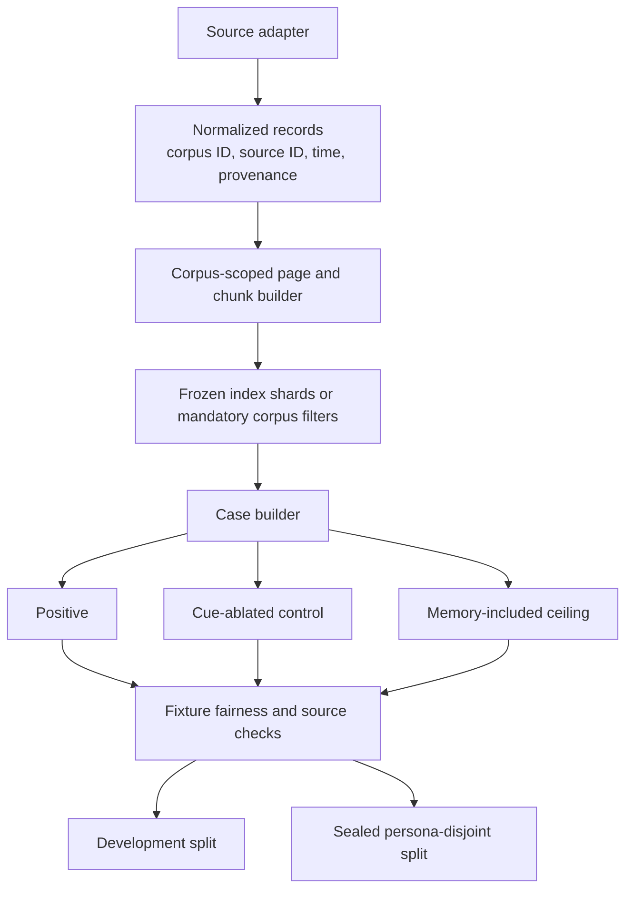

# Larger Dataset Candidates

This survey asks which public datasets can expand PARMBench without changing
the research question. A useful source must support more than long-context
recall. It needs a longitudinal memory corpus, a later observation that can
introduce a new cue, and a counterfactual where removing that cue should prevent
memory from changing the answer.

The survey was checked against Hugging Face dataset cards and schemas on
2026-07-27. It covered long-term memory, personalization, multi-session
dialogue, agent trajectories, tool use, task-oriented dialogue, recommendation,
email, and calendar-like data.

## Recommendation

Use two sources for different parts of the next evaluation:

1. Build the larger controlled benchmark from
   [PersonaMem-v2](https://huggingface.co/datasets/bowen-upenn/PersonaMem-v2).
   It has the best raw material for generating PARMBench triplets at scale:
   isolated personas, long histories, implicit preferences, gold related
   snippets, correct and incorrect answers, preference updates, and
   persona-disjoint splits.
2. Build the realistic end-to-end suite from
   [LongMemEval-V2](https://huggingface.co/datasets/xiaowu0162/longmemeval-v2).
   Its web and enterprise trajectories supply natural agent observations and
   recurring task state. These cases require human review but make a stronger
   real-world claim than generated catalogs.

These sources are complementary. PersonaMem-v2 provides enough structured data
to compare retrieval mechanisms and tune on separate users. LongMemEval-V2
provides the realistic traces needed to test whether the mechanism helps an
agent doing ordinary work.

## Candidate comparison

| Dataset | Verified scale | What it contributes | Required reconstruction | Reuse status |
| --- | ---: | --- | --- | --- |
| [PersonaMem-v2](https://huggingface.co/datasets/bowen-upenn/PersonaMem-v2) | 1,000 personas and 26,100 unique preference, snippet, and Q&A records; 32K and 128K histories | Implicit personal facts, source snippets, answer counterfactuals, updates, sensitive-data flags, persona-disjoint train/validation/benchmark splits | Turn each direct personalization query into an ordinary task plus a later tool result that reveals the cue; build one memory corpus per persona | CC BY 4.0; synthetic data with documented safety filtering |
| [LongMemEval-V2](https://huggingface.co/datasets/xiaowu0162/longmemeval-v2) | 451 human-curated questions and 1,870 web or enterprise task trajectories | Natural late observations, screenshots, changing task state, workflows, and environment-specific knowledge | Map earlier trajectory facts into memory records; pair later observations with cue-ablated twins; review each case by hand | Apache 2.0 |
| [Amazon Reviews 2023](https://huggingface.co/datasets/McAuley-Lab/Amazon-Reviews-2023) | 571.54 million reviews, 54.51 million users, and 48.19 million items | Real longitudinal preferences, timestamps, product text, metadata, and exact held-out interactions | Use a bounded category and k-core subset; turn candidate products into a later search result; prevent future-review leakage | No license is stated on the Hugging Face card; source terms and privacy review are required |
| [LongMemEval cleaned](https://huggingface.co/datasets/xiaowu0162/longmemeval-cleaned) | 500-question LongMemEval-S lineage with roughly 100K-token histories | Large-context retrieval stress, exact answers, temporal and multi-session memory | Move the decisive query fact into a later observation and preserve the original answer; construction is less natural than PersonaMem-v2 | MIT |
| [LongLaMP](https://huggingface.co/datasets/LongLaMP/LongLaMP) | 130,569 examples across abstract, product-review, and topic-writing configurations | Long user profiles and natural long-form outputs at useful scale | Synthesize later observations; add paired controls; use human or calibrated-judge scoring for open-ended output | No license is stated on the Hugging Face card |
| [Multi-Session Chat](https://huggingface.co/datasets/nayohan/multi_session_chat) | 23,445 session rows in the inspected mirror | Multi-session personal facts and dialogue-level corpus boundaries | Generate task, tool result, gold decision, and counterfactual; audit conversational quality | Mirror card has no license; another cleaned mirror states GPL 3.0 |
| [LoCoMo](https://huggingface.co/datasets/adymaharana/locomo) | 35 long conversations | Dense longitudinal episodes and personal relationships | Construct and review all output-cued tasks; too few profiles for the main scale benchmark | CC BY-NC 4.0 |
| [Enron email](https://huggingface.co/datasets/corbt/enron-emails) | 517,401 messages | Real enterprise history, commitments, relationships, and timestamps | Isolate mailboxes, redact personal data, annotate late cues and gold actions, and construct controls | No license is stated on the inspected card; high privacy and redistribution risk |
| [CoMEM agent trajectories](https://huggingface.co/datasets/WenyiWU0111/CoMEM-agent-memory-trajectories) | 222,235 generated tasks and 188,451 GUI trajectories | Large GUI task and observation source with success and failure traces | Determine whether earlier traces contain reusable memory; add user-specific facts and causal controls | Apache 2.0 |
| [Taskmaster-2](https://huggingface.co/datasets/google-research-datasets/taskmaster2) | About 17,300 spoken task-oriented dialogues in seven domains | Natural search and recommendation language plus annotated slots | No persistent user histories; would need a separate memory source and synthetic cross-session identity | CC BY 4.0 |
| [ToolBench mirror](https://huggingface.co/datasets/Maurus/ToolBench) | 88,895 API-query rows | Tool schemas and query domains | No longitudinal user memory or full observation traces in this mirror; useful only as an output scaffold | No license is stated on the inspected mirror card |

Small long-memory instruction sets, generic QA corpora, and software-agent
trajectories were excluded from the shortlist when they lacked either
longitudinal identity or a meaningful personal decision. Large row count alone
does not create a PARM case.

## PersonaMem-v2 conversion

PersonaMem-v2 is close to the desired data model, but its original query often
states the topic for which the buried preference matters. Using it unchanged
would test ordinary long-context personalization rather than output-cued
retrieval. The conversion must relocate the decisive cue.

For each accepted record:

1. Treat the persona's chat history as the private memory corpus.
2. Preserve the related conversation snippet as the gold source record.
3. Rewrite the user query into an ordinary, independently answerable task.
4. Generate a realistic tool result or candidate list. Only one region should
   intersect with the buried preference or constraint.
5. Derive the memory-conditioned choice from the supplied correct answer and
   use the supplied incorrect answers as counterfactual material.
6. Create the cue-ablated twin by changing only the triggering affordance in
   the tool result.
7. Create the memory-included ceiling by exposing the gold source fact.
8. Reject the scenario unless a no-memory model passes the control and the
   ceiling model passes the positive case.

Use `train_text` to develop generation and filtering rules, `val_text` for
retrieval calibration, and keep `benchmark_text` sealed until the complete
policy is frozen. Split and report by `persona_id`; never place records from
one persona in both development and held-out sets.

A useful first release is 500 human-audited triplets across at least 100 held-out
personas. Automated generation can produce a larger candidate pool, but the
published cases need review for prompt independence, symmetric controls,
answerability, privacy restraint, and exact source provenance.

## LongMemEval-V2 conversion

LongMemEval-V2 should supply the end-to-end evidence described in
[Real-World Evaluation](real-world-evaluation.md). Each case starts from one
trajectory and one earlier fact that changes the correct action after a later
observation.

Prefer traces where:

- the initial instruction does not name the relevant prior state;
- a later page, ticket, form, or screenshot exposes the cue;
- the earlier fact has a stable source step and timestamp;
- removing or replacing the later cue leaves a plausible control task; and
- task success can be checked from environment state as well as response text.

Start with 50 to 100 reviewed scenarios covering both web and enterprise
agents. Compare PARM, input RAG, naive output RAG, all-entity output RAG, and
the prompted memory-tool agent over the same history and task agent. Use exact
state checks where available, then apply the calibrated judge protocol only to
open-ended response dimensions.

## Retrieval substrate changes

The current frozen `amara-life-v1` index assumes one user. Scaling to public
datasets requires corpus isolation to become part of the index contract.

The implementation should add:

- a source-adapter interface for PersonaMem, agent trajectories, and review
  histories;
- a required `corpus_id` on every page, chunk, case, and retrieval trace;
- per-corpus index shards or a mandatory retrieval filter that cannot search
  another person's records;
- normalized source IDs, timestamps, update status, and sensitivity metadata;
- an adapter-owned case builder that records every transformation;
- exact-choice and environment-state scoring beside optional rubric judgment;
- user-level split validation; and
- a dataset admission check for license, consent, personal data, and future
  leakage.

Rebuilding the GBrain-derived export is preferable to stretching
`amara-life-v1`. A single global index without enforced corpus filters would
create cross-person leakage and inflated distractor counts that do not model a
personal agent.

## Proposed execution order

1. Implement the normalized corpus and adapter interfaces without changing the
   current benchmark schema.
2. Convert 30 PersonaMem-v2 development records and run the full baseline
   matrix as a feasibility check.
3. Freeze transformation prompts and acceptance tests, then generate a large
   candidate pool from `val_text`.
4. Audit and publish 500 triplets from sealed personas.
5. Construct 50 to 100 LongMemEval-V2 end-to-end cases and calibrate human and
   model judges.
6. Add an Amazon category subset only after reuse terms and privacy handling
   are resolved.

This sequence keeps the current deterministic benchmark as the regression
gate, adds a genuinely held-out multi-person benchmark, and supplies natural
agent traces for the broader product claim.
